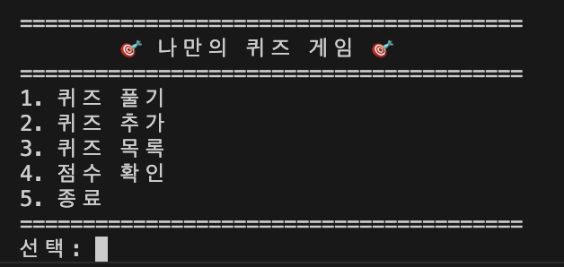
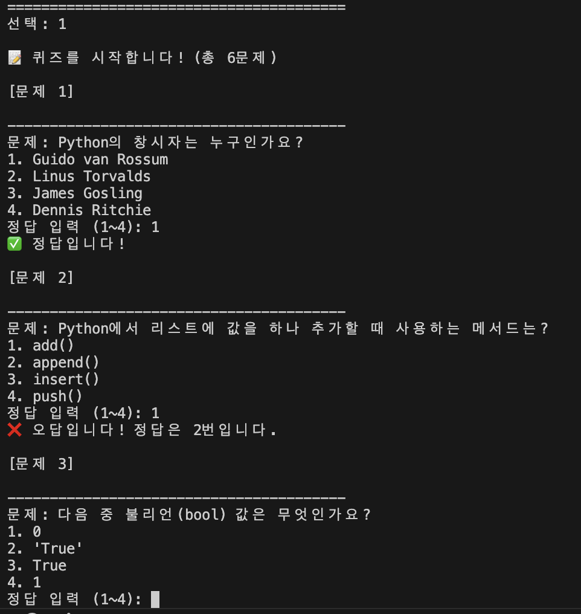
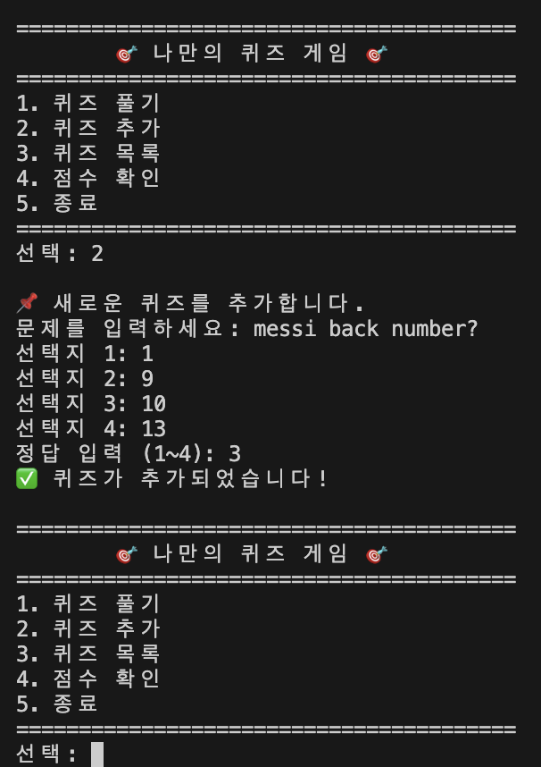
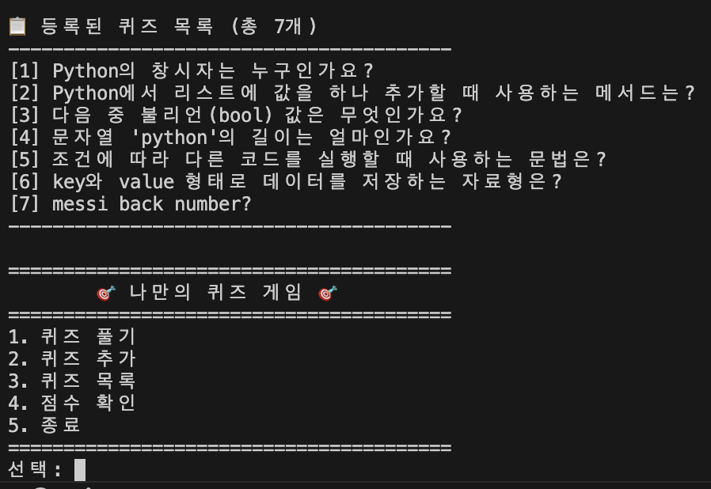
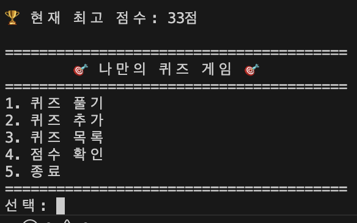
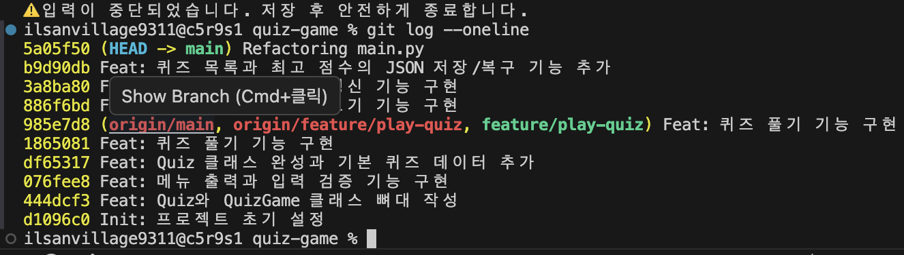
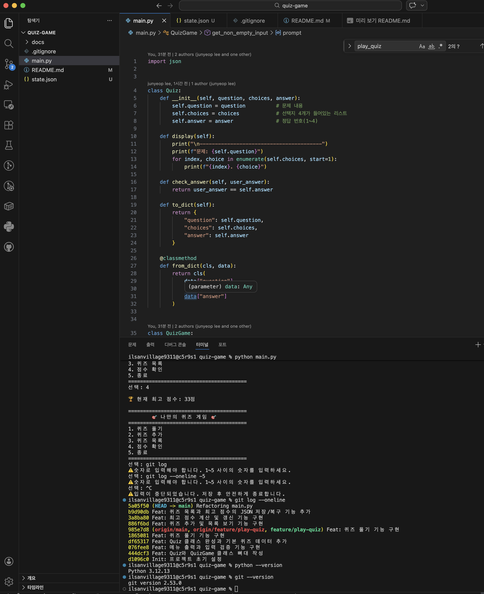

# 🎯 나만의 퀴즈 게임

## 1. 프로젝트 개요
Python으로 만든 콘솔 기반 퀴즈 게임입니다.  
메뉴를 통해 퀴즈를 풀고, 새로운 퀴즈를 추가하고, 퀴즈 목록과 최고 점수를 확인할 수 있습니다.  
데이터는 `state.json`에 저장되어 프로그램을 다시 실행해도 유지됩니다.

---

## 2. 퀴즈 주제 선정 이유
퀴즈 주제는 **Python 기초 문법**입니다.  
Python을 처음 배우는 과정에서 자주 나오는 개념을 문제로 만들어 복습할 수 있도록 선택했습니다.

---

## 3. 실행 방법
### 실행 환경
- Python 3.10 이상

### 실행 명령어
```bash
python main.py
```

---

## 4. 기능 목록
퀴즈 풀기: 저장된 퀴즈를 풀고 점수를 계산합니다.
퀴즈 추가: 문제, 선택지 4개, 정답 번호를 입력해 새 퀴즈를 등록합니다.
퀴즈 목록: 현재 저장된 퀴즈 목록을 확인합니다.
점수 확인: 최고 점수를 확인합니다.
데이터 저장: 퀴즈와 최고 점수를 state.json에 저장합니다.
예외 처리: 빈 입력, 문자 입력, 범위 밖 숫자, Ctrl+C, EOFError, 파일 손상 등을 처리합니다.

---

## 5. 파일 구조
```bash
quiz-game/
├── main.py
├── state.json
├── README.md
├── .gitignore
└── docs/
    └── screenshots/
        ├── menu.png
        ├── play.png
        ├── add_quiz.png
        ├── list.png
        ├── score.png
        ├── git_log.png
        └── environment.png
```

---

## 6. 데이터 파일 설명
파일 경로
  프로젝트 루트의 state.json
역할
  퀴즈 목록 저장
  최고 점수 저장
데이터 구조 예시
```bash
{
    "quizzes": [
        {
            "question": "Python의 창시자는 누구인가요?",
            "choices": [
                "Guido van Rossum",
                "Linus Torvalds",
                "James Gosling",
                "Dennis Ritchie"
            ],
            "answer": 1
        }
    ],
    "best_score": 80
}
```
필드 설명
quizzes: 퀴즈 목록
question: 문제 내용
choices: 선택지 4개
answer: 정답 번호(1~4)
best_score: 최고 점수 (null 가능)

---

## 7. 실행 화면 스크린 샷
#### 메뉴 화면


#### 퀴즈 풀기


#### 퀴즈 추가


#### 퀴즈 목록


#### 점수 확인


#### git log 결과


#### 개발 환경


---